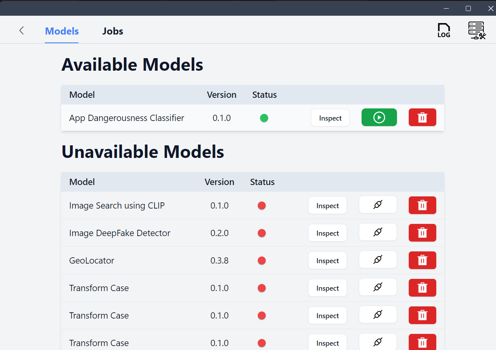

# Review Dangerousness Classifier using ONNX

To determine whether an app is safe or not using binary classification based on app reviews. This model is BERT finetuned on a custom dataset to classify whether an app is "safe" or "not-safe" based on reviews given to it by users.

## Steps to use this repo
### Clone this repository and navigate to root folder

```bash
git clone https://github.com/lous-e/596E_Project1
cd 596E_Project1
```


### Create virtual environment and install dependencies
Create a new virtual environment using any tool you prefer. We use `venv` for this example (on a Windows machine)

```bash
python -m venv venv
venv/Scripts/activate
```

Install the dependencies using the following command:

```bash
pip install -r requirements.txt
```

### Download the model
Download the ONNX model from the following link: [Model](https://drive.google.com/file/d/154S15EOJRLfaDYIo_xPGt_HQbXgD36A8/view?usp=sharing)

Place the model in the root directory of this project.

### Run the Flask-ML server

Run the following command to start the Flask-ML server (for Windows):

```bash
python -m server
```

### Command line interface
To return the input string and model prediction in an `output.json` file
```bash
# text_to_classify is the input string, such as "this app is amazing"
python client.py --input_text [text_to_classify]
```
<!-- The command line interface can be used to test the model. Run the following command to test the model:

```bash
# image_dir is the directory containing the images
python deepfake_cli.py --input_dir path/to/image_dir --output_dir path/to/output_dir
``` -->

## Steps to export ONNX model
### Clone this repository found [here](https://github.com/DeepikaDG2310/ML596E)

- Clone this repository and delete ```config.py```
- Copy the files ```App_dangerrousness.py```, ```bert_classifier.pth```, ```config.py``` into the root directory of the folder.
- Configure Rescue Box Desktop to work with this using the instructions detailed below
- Uncomment the code at Lines 19, 57, 86 under "Original" and comment out the corresponding code under "ONNX".
- Run the server with the following command after following installation procedures
```bash
python -m server
```
The commented out code sets a breakpoint at Line 91 by adding the following line: import pdb; pdb.set_trace(). Send a request to the backend again using the same inputs from the RescueBox Desktop application. The breakpoint will be triggered in the backend.
Run the following python code to export the ONNX model (also given in ```server.py```)
```{python}
torch.onnx.export(model, text, "review_classifier_model.onnx", export_params = True, opset_version = 16, do_constant_folding = True, input_names = ["input"], output_names = ["output"], dynamic_axes={'input' : {0 : 'batch_size'},'output' : {0 : 'batch_size'}})
```
The resulting ONNX model will be saved as ```review_classifier_model.onnx``` in the directory where ```server.py``` exists.

### Download and run RescueBox Desktop from the following link: [Rescue Box Desktop](https://github.com/UMass-Rescue/RescueBox-Desktop/releases)

#### Open the RescueBox Desktop application and register the model


#### Run the model



#### View the results


### Attribution
This example uses a model that was originally created by a student in the Fall 2024 offering of 596E. The model has been modified to work with ONNX models. Their repo can be found [here](https://github.com/DeepikaDG2310/ML596E). Additionally, the code structure and documentation are based on [this](https://github.com/UMass-Rescue/deepfake-image-onnx) repo.

The base model is BERT, derived from the following paper:

```bibtex
@article{DBLP:journals/corr/abs-1810-04805,
  author       = {Jacob Devlin and
                  Ming{-}Wei Chang and
                  Kenton Lee and
                  Kristina Toutanova},
  title        = {{BERT:} Pre-training of Deep Bidirectional Transformers for Language
                  Understanding},
  journal      = {CoRR},
  volume       = {abs/1810.04805},
  year         = {2018},
  url          = {http://arxiv.org/abs/1810.04805},
  eprinttype    = {arXiv},
  eprint       = {1810.04805},
  timestamp    = {Tue, 30 Oct 2018 20:39:56 +0100},
  biburl       = {https://dblp.org/rec/journals/corr/abs-1810-04805.bib},
  bibsource    = {dblp computer science bibliography, https://dblp.org}
}
